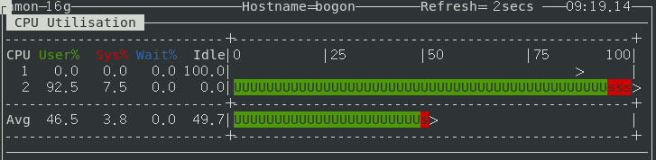
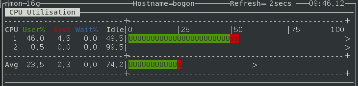
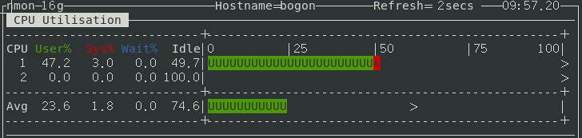
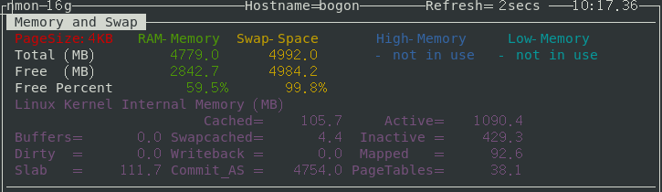

[TOC]

# 一、测试环境

## 1.1 系统信息

```bash
[root@bogon ~]# hostnamectl
   Static hostname: localhost
Transient hostname: bogon
         Icon name: computer-vm
           Chassis: vm
        Machine ID: cd3af12940a9408f91cd9291b484c14f
           Boot ID: 3b033ed1dce4451e9e439985952d8543
    Virtualization: vmware
  Operating System: Red Hat Enterprise Linux Server 7.6 (Maipo)
       CPE OS Name: cpe:/o:redhat:enterprise_linux:7.6:GA:server
            Kernel: Linux 3.10.0-957.el7.x86_64
      Architecture: x86-64
```

## 1.2 CPU信息

1 CPU，2 核。

## 1.3 空闲时内存状态

```bash
[root@bogon ~]# free -m
              total        used        free      shared  buff/cache   available
Mem:           4779        1732        2826          21         219        2767
Swap:          4991           7        4984
```

## 1.4 cgroups挂载点

测试环境cgroups挂载点在 /sys/fs/cgroup：

```bash
[root@bogon ~]# grep cgroup /proc/mounts | head -n 1 | awk '{print $2}'
/sys/fs/cgroup
```

# 二、限制CPU

## 2.1 准备测试脚本

编写一个消耗CPU资源的脚本，命名为cg_cpu.sh：

```bash
#! /bin/bash
i=0
while [ true ]; do
    i=$(($i+1))
done
```

直接运行脚本（PID为62555）：

```bash
[root@bogon ~]# ./cg_cpu.sh &
[1] 62555
```

CPU使用情况如下，因为这个脚本是单进程单线程执行的，所以占一个核的100%使用率。



## 2.2 限制进程的CPU占用百分比

```bash
[root@bogon ~]# mkdir -p /sys/fs/cgroup/cpu/demo    # 新建cpu控制组demo
[root@bogon ~]# echo 50000 > /sys/fs/cgroup/cpu/demo/cpu.cfs_quota_us  # 相对于cpu.cfs_period_us的50%
[root@bogon ~]# cat /sys/fs/cgroup/cpu/demo/cpu.cfs_period_us
100000

[root@bogon ~]# echo 62555 > /sys/fs/cgroup/cpu/demo/tasks # 进程PID加到task列表
```

资源限制立即生效了，CPU使用率被控制在50%左右：



## 2.3 进程绑定的CPU和内存组

上面的demo也可以看出，进程在两个核直接切换运行。下面演示将进程绑定到指定的CPU核。

```bash
[root@bogon ~]# mkdir -p /sys/fs/cgroup/cpuset/demo  # 新建cpuset控制组demo
[root@bogon ~]# echo 0 > /sys/fs/cgroup/cpuset/demo/cpuset.cpus
[root@bogon ~]# echo 0 > /sys/fs/cgroup/cpuset/demo/cpuset.mems  #cpuset.cpus核cpuset.mems必须都设置
[root@bogon ~]# echo 62555 > /sys/fs/cgroup/cpuset/demo/tasks

[root@bogon ~]# cat /proc/62555/status | grep 'allowed_list'  # 查询限制状态
Cpus_allowed_list:	0
Mems_allowed_list:	0
```

经观察，进程被限制在第一个CPU核上运行：



## 2.4 控制进程之间的CPU使用率配比

cpu.shares是用来限制CPU使用配比的。与cpu.cfs_quota_us、cpu.cfs_period_us不同。cpu.shares不是限制进程能使用的绝对的CPU时间，而是控制各个组之间的相对配额。例如：

```bash
/cpu/demo1/cpu.shares : 1024
/cpu/demo2/cpu.shares : 512
```

那么demo1和demo2之间CPU配比是2:1，当CPU满负荷时，demo1 CPU使用率占2/3，而demo2占1/3。

继续使用上述脚本，但是我们将运行同时运行2个实例。

```bash
[root@bogon ~]# mkdir -p /sys/fs/cgroup/cpu/demo1
[root@bogon ~]# mkdir -p /sys/fs/cgroup/cpu/demo2
[root@bogon ~]# echo 1024 > /sys/fs/cgroup/cpu/demo1/cpu.shares
[root@bogon ~]# echo 512 > /sys/fs/cgroup/cpu/demo2/cpu.shares

[root@bogon ~]# ./cg_cpu.sh 1 &
[1] 76198
[root@bogon ~]# ./cg_cpu.sh 2 &
[2] 76211

[root@bogon ~]# echo 76198 > /sys/fs/cgroup/cpu/demo1/tasks
[root@bogon ~]# echo 76211 > /sys/fs/cgroup/cpu/demo2/tasks
```

在一个双核系统中，可以发现两个核的CPU使用率都接近100%。我们下面把两个进程绑到同一个核上再看看：

```bash
[root@bogon ~]# mkdir -p /sys/fs/cgroup/cpuset/demo1
[root@bogon ~]# mkdir -p /sys/fs/cgroup/cpuset/demo2
[root@bogon ~]# echo 0 > /sys/fs/cgroup/cpuset/demo1/cpuset.cpus
[root@bogon ~]# echo 0 > /sys/fs/cgroup/cpuset/demo1/cpuset.mems
[root@bogon ~]# echo 0 > /sys/fs/cgroup/cpuset/demo2/cpuset.cpus 
[root@bogon ~]# echo 0 > /sys/fs/cgroup/cpuset/demo2/cpuset.mems
[root@bogon ~]# echo 76198 > /sys/fs/cgroup/cpuset/demo1/tasks 
[root@bogon ~]# echo 76211 > /sys/fs/cgroup/cpuset/demo2/tasks 
```

现在可以观察到demo1和demo2的CPU使用率比例接近2:1。

```bash
   PID USER      PR  NI    VIRT    RES    SHR S  %CPU %MEM     TIME+ COMMAND
 76198 root      20   0  113180   1208   1016 R  66.4  0.0  45:31.79 cg_cpu.sh
 76211 root      20   0  113180   1208   1016 R  33.6  0.0  44:33.45 cg_cpu.sh
```

# 三、限制内存

## 3.1 准备测试脚本

编写一个不断消耗内存的脚本，命名为cg_mem.sh：

```bash
#! /bin/bash
t="eat-mem"
while [ true ]; do
    t=$t$t
done
```

执行脚本前先清缓存，内存初始状态下图所示（系统总内存为5GB）。

```bash
[root@bogon ~]# sync
[root@bogon ~]# echo 3 > /proc/sys/vm/drop_caches
[root@bogon ~]# swapoff -a   # 关闭swap
```



注：测试最好关闭swap，否则物理内存耗尽后，会触发swap，后面的内存限制测试不能获得理想测试效果。

直接执行cg_mem.sh。运行一段时间，当“Free Percent”小于30%后，内存分配失败，报错退出：

```bash
[root@bogon ~]# ./cg_mem.sh 
demo/cg_mem.sh: xmalloc: 无法分配 1879048193 字节 (40960 字节已分配)
```

## 3.2 限制内存

```bash
[root@bogon ~]# mkdir -p /sys/fs/cgroup/memory/demo
[root@bogon ~]# echo 2097152 > /sys/fs/cgroup/memory/demo/memory.limit_in_bytes  # 限制使用2MB内存

[root@bogon ~]# demo/cg_mem.sh &
[1] 64191
[root@bogon ~]# echo 64191 > /sys/fs/cgroup/memory/demo/tasks
```

很快就触发OOM，进程被kill。

# 四、清理测试环境

删除以上创建的层级：

```bash
[root@bogon ~]# cgdelete -r memory:demo  # cgdelete需要安装libcgroup-tools
[root@bogon ~]# cgdelete -r cpu:demo
[root@bogon ~]# cgdelete -r cpuset:demo
[root@bogon ~]# cgdelete -r cpu:demo1
[root@bogon ~]# cgdelete -r cpu:demo2
```

参数 -r 表示递归地删除层级。
