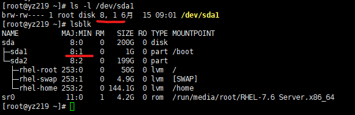

[TOC]

# 一、准备

## 1.1 术语

- `IOPS`：`Input/Output Per Second`, 每秒钟磁盘IO次数。
- `BPS`：`Byte Per Second`, 每秒种磁盘读写数据量。

## 1.2 内核配置要求

首先内核配置必须要满足如下要求：

```bash
CONFIG_BLK_CGROUP=y
CONFIG_BLK_DEV_THROTTLING=y
```

配置在`/boot/config-XXX`文件，例如：`/boot/config-3.10.0-957.el7.x86_64`。

## 1.3 查询磁盘设备号

使用`ls -l`命令，或者`lsblk`命令。例如，下图中`/dev/sda1`的设备号（`major:minor`）为 `8:1` 。



或者使用其它方法获取，例如：

```bash
[root@yz219 blkio]# cat /proc/partitions
major minor  #blocks  name

   8        0  209715200 sda
   8        1    1048576 sda1
   8        2  208665600 sda2
  11        0    4391936 sr0
 253        0   52428800 dm-0
 253        1    5111808 dm-1
 253        2  151117824 dm-2
```

## 1.4 准备cgroup

假设`blkio`挂载点在：

```bash
[yz@yz219 blkio]$ pwd
/sys/fs/cgroup/blkio
```

准备测试将使用的层级：

```bash
[yz@yz219 blkio]$ sudo mkdir yz
[yz@yz219 blkio]$ sudo chown yz:yz -R yz
[yz@yz219 blkio]$ cd yz/
[yz@yz219 yz]$ mkdir 1
[yz@yz219 yz]$ mkdir 2
[yz@yz219 yz]$ ll
drwxrwxr-x 2 yz yz 0 6月  21 09:38 1
drwxrwxr-x 2 yz yz 0 6月  21 09:38 2
……
-r--r--r-- 1 yz yz 0 6月  21 09:37 blkio.throttle.io_service_bytes
-r--r--r-- 1 yz yz 0 6月  21 09:37 blkio.throttle.io_serviced
-rw-r--r-- 1 yz yz 0 6月  21 09:37 blkio.throttle.read_bps_device
-rw-r--r-- 1 yz yz 0 6月  21 09:37 blkio.throttle.read_iops_device
-rw-r--r-- 1 yz yz 0 6月  21 09:37 blkio.throttle.write_bps_device
-rw-r--r-- 1 yz yz 0 6月  21 09:37 blkio.throttle.write_iops_device
-rw-r--r-- 1 yz yz 0 6月  21 09:37 cgroup.clone_children
-rw-r--r-- 1 yz yz 0 6月  21 09:37 cgroup.procs
-rw-r--r-- 1 yz yz 0 6月  21 09:37 tasks
```

## 1.5 清缓存

在每次IO读写之前必须清理缓存：

```bash
sync
echo 3 > /proc/sys/vm/drop_caches
```

# 二、测试

本文以`rhel-home`设备为例，设备号为`253:2`。

## 2.1 全系统限制测试

全系统限制设备的`bps`读速率为`1M/s`：

```bash
[root@yz219 ~]# cd /sys/fs/cgroup/blkio
[root@yz219 blkio]# echo "253:2  1048576" > blkio.throttle.read_bps_device
[root@yz219 blkio]# cat blkio.throttle.read_bps_device
253:2 1048576
```

`dd`读盘：

```bash
# 准备一个24M的文件：
[root@yz219 blkio]# ll -h /home/yz/customer.tbl
-rwxr-xr-x 1 root root 24M 6月  21 10:07 /home/yz/customer.tbl

# 为保证测试准确，务必清缓存：
[root@yz219 blkio]# sync
[root@yz219 blkio]# echo 3 > /proc/sys/vm/drop_caches

# dd读文件
[root@yz219 blkio]# dd if=/home/yz/customer.tbl of=/dev/null bs=1M count=512
记录了23+1 的读入
记录了23+1 的写出
24196144字节(24 MB)已复制，23.3716 秒，1.0 MB/秒
```

## 2.2 进程限速

使用以下资源组做测试：

```bash
# 先解除全系统的限制：
[root@yz219 blkio]# pwd
/sys/fs/cgroup/blkio
[root@yz219 blkio]# echo "253:2  0" > blkio.throttle.read_bps_device
[root@yz219 blkio]# cat blkio.throttle.read_bps_device

# 在资源组1做限制：
[root@yz219 blkio]# cd yz/1
[root@yz219 1]# pwd
/sys/fs/cgroup/blkio/yz/1
[root@yz219 1]# echo "253:2  1048576" > blkio.throttle.read_bps_device
[root@yz219 1]# cat blkio.throttle.read_bps_device
253:2 1048576
```

准备一个测试脚本：

```bash
[root@yz219 1]# vim ~/ioblk_demo.sh
sync
echo 3 > /proc/sys/vm/drop_caches

dd if=/home/yz/customer.tbl of=/dev/null bs=1M count=512 &
echo $! > /sys/fs/cgroup/blkio/yz/1/tasks
```

执行脚本，大约24秒后会在终端输出dd结果：

```bash
[root@yz219 1]# ~/ioblk_demo.sh 
[root@yz219 1]# 记录了23+1 的读入
记录了23+1 的写出
24196144字节(24 MB)已复制，23.0069 秒，1.1 MB/秒
^C
```

在脚本执行过程中，我们可以检查以下资源组1中的`PID`是否为预期值：

```bash
[root@yz219 ~]# cat /sys/fs/cgroup/blkio/yz/1/cgroup.procs 
68246
[root@yz219 ~]# cat /sys/fs/cgroup/blkio/yz/1/tasks 
68246
[root@yz219 ~]# ps ux | grep customer.tbl
root      68246  0.0  0.0 109132  1408 pts/4    D    10:35   0:00 dd if=/home/yz/customer.tbl of=/dev/null bs=1M count=512
```

# 三、blkio.weight测试

## 3.1 blkio.weight

`cgroup`的`blkio.weight`可以控制磁盘IO权重。

> blkio.weight：此参数用于指定一个 cgroup 在默认情况下可存取块 I/O 的相对比例（加权），范围是 100 到1000。该值可被指定设备的 blkio.weight_device 参数覆盖。

注意：该功能仅适用于`CFQ`磁盘调度算法（Linux内核磁盘IO电梯算法）

## 3.2 查询与修改磁盘调度算法

查询磁盘调度算法，以下以sda盘为例：

```bash
[yz@bogon ~]$ cat /sys/block/sda/queue/scheduler
noop [deadline] cfq
```

修改调度算法：

```bash
[yz@bogon ~]$ sudo sh -c "echo cfq > /sys/block/sda/queue/scheduler"
[yz@bogon ~]$ cat /sys/block/sda/queue/scheduler
noop deadline [cfq]
```

## 3.3 配置cgroup

切换当前目录：

```bash
[yz@bogon ~]$ cd /sys/fs/cgroup/blkio/yz/
[yz@bogon yz]$ mkdir hi
[yz@bogon yz]$ mkdir lo
```

`hi`（高权重组）和 `lo`（低权重组）的`blkio.weight`分别配置为1000和100：

```bash
[yz@bogon yz]$ echo 1000 > hi/blkio.weight
[yz@bogon yz]$ echo 100 > lo/blkio.weight
```

## 3.4 dd测试

分别从两个终端执行`dd`，对`sda`盘执行写操作：

终端1（高权重组）：

```bash
[yz@bogon ~]$ cgexec -g "blkio:yz/hi" dd if=/dev/zero of=./big.txt bs=10M oflag=direct
```

终端2（低权重组）：

```bash
[yz@bogon ~]$ cgexec -g "blkio:yz/lo" dd if=/dev/zero of=./low.txt bs=10M oflag=direct
```

执行一段时间后，查看两个`dd`的统计情况：

```bash
[yz@bogon ~]$ cgexec -g "blkio:yz/hi" dd if=/dev/zero of=./big.txt bs=10M oflag=direct
^C记录了4993+0 的读入
记录了4993+0 的写出
52355399680字节(52 GB)已复制，250.286 秒，209 MB/秒

[yz@bogon ~]$  cgexec -g "blkio:yz/lo" dd if=/dev/zero of=./low.txt bs=10M oflag=direct
^C记录了224+0 的读入
记录了224+0 的写出
2348810240字节(2.3 GB)已复制，78.0385 秒，30.1 MB/秒
```

总体上两个优先级的IO速度差异很明显。

需要说明的是，两个组的速度比并不是10:1，主要原因是`blkio.weight`是当IO发生争抢时的优先级，当IO比较空闲时，两个组不按照上述权重分配IO资源。

# 四、参考

- [use cgroup blkio resource control limit throttle](https://developer.aliyun.com/article/8972)
- [Block Throttle](https://developer.aliyun.com/article/789736)

